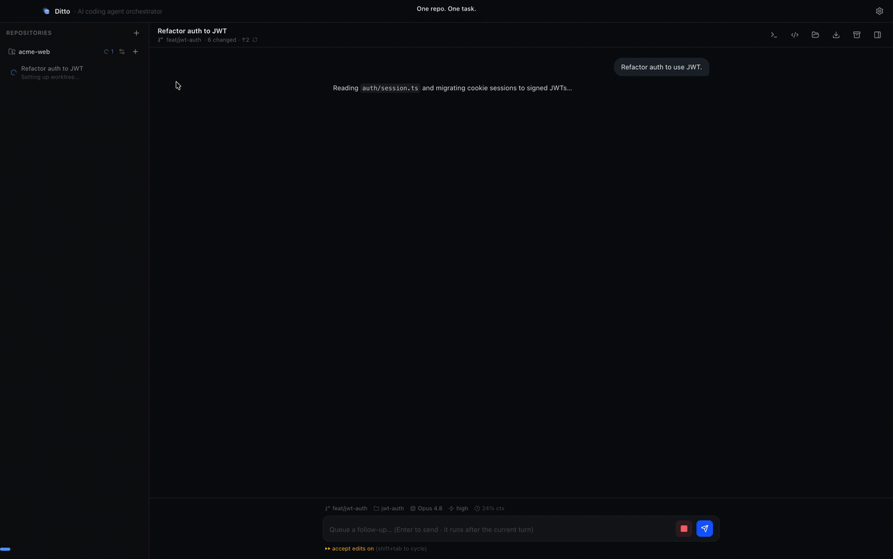

# Wooi

**여러 AI 코딩 에이전트를 동시에 — 각자 자기 git worktree 위에서, 각자 자기 PR 로.**

[English](./README.md) · **한국어**



Wooi 는 여러 **AI 코딩 에이전트**를 각자 격리된 git worktree 위에서 병렬로 오케스트레이션하는
macOS 데스크톱 앱입니다. 작업 1개당 전용 worktree + 브랜치 + 에이전트 세션이 돌아가며, 모든 세션은
**자동 프롬프트 없이 빈 입력창**으로 시작합니다 — 첫 메시지를 보내기 전까지 아무것도 실행되지 않습니다.

> **에이전트 지원** — Wooi 는 현재 **Claude Code**(Claude Agent SDK 경유)를 구동합니다.
> 앞으로 **Codex** 등 더 다양한 에이전트를 지원할 예정입니다.

## 왜 Wooi 인가

- 🧵 **진짜 병렬** — 리팩터링·기능 추가·버그 수정을 한꺼번에 시작하고, 사이드바 하나에서 셋 다 지켜봅니다.
- 🔒 **기본이 격리** — 작업마다 별도 worktree + 브랜치라, 공유 작업 트리에서 에이전트끼리 충돌하지 않습니다.
- 🚢 **PR 친화적** — 에이전트의 diff 에서 GitHub PR 까지 클릭 한 번으로 넘어갑니다.
- 🕵️ **텔레메트리 없음** — 자체 서버 없이, 대화 기록은 로컬에만 저장됩니다.

**[최신 릴리스 다운로드 →](https://github.com/youngminnnn/wooi/releases/latest/download/Wooi-arm64.dmg)**

## 설치

Wooi 는 **서명 및 공증(Apple Developer ID)** 된 `.dmg` 로 배포됩니다 — macOS
Gatekeeper 경고 없이 바로 실행됩니다.

1. [최신 `.dmg`](https://github.com/youngminnnn/wooi/releases/latest/download/Wooi-arm64.dmg) 를
   받아 **Wooi** 를 **Applications** 로 드래그합니다. 이전 빌드는
   [Releases 페이지](https://github.com/youngminnnn/wooi/releases)에 있습니다.
2. **Applications** 에서 **Wooi** 를 실행합니다.

## 업데이트

Wooi 는 스스로 업데이트합니다: 실행 시 GitHub Releases 를 확인해 새 버전을
백그라운드로 내려받고, 준비되면 **"Restart to update"** 배너를 띄웁니다.
**설정 → About** 에서 수동으로 확인할 수도 있습니다.

> **v1.0.0 사용 중이신가요?** 이 버전은 자동 업데이트 기능이 들어가기 전이라
> 스스로 갱신되지 않습니다 — Releases 페이지에서 **v1.0.1 이상을 한 번만 수동으로**
> 받아 주세요. v1.0.1 부터는 모든 버전이 자동으로 업데이트됩니다.

## 컨셉

- **Repository** — git 리포를 연결합니다(메인 체크아웃).
- **Workspace** — 작업 1개 = 전용 git worktree + 브랜치 + 에이전트 세션 1개.
  `~/wooi/workspaces/<repo>/<branch>` 에 생성됩니다.
- 각 workspace 는 **독립적·병렬**로 실행됩니다. 한 workspace 에서 에이전트가 돌아가는 동안
  다른 workspace 를 열어 계속 작업할 수 있습니다.
- **Setup / Dev / Archive 스크립트** — 리포 단위로 지정합니다(`npm install`, `npm run dev` 등).
  setup 은 workspace 생성 시 자동 실행(옵션), dev 는 스크립트 패널에서 실행/중지하며,
  archive 는 workspace 를 아카이브할 때 1회 실행됩니다.

## 시작하기

Wooi 를 처음 실행하면 온보딩이 다음을 안내합니다:

1. 약관·개인정보처리방침 **동의**(진행하려면 필수).
2. Claude·GitHub **로그인**. CLI 가 설치돼 있지 않으면 설치 링크를 보여줍니다.
   **Claude 로그인은 앱 안에서 브라우저로** 마무리되고, **GitHub 로그인은 Terminal** 에서
   진행됩니다. **GitHub CLI(`gh`)는 필수**라 `gh` 설치·로그인을 마치기 전에는 온보딩(및 앱 사용)을
   끝낼 수 없습니다. 연동 상태는 언제든 **Settings → Integrations** 에서 변경할 수 있습니다.

Wooi 는 **설치된 Claude Code 와 `gh` CLI 의 로그인 정보를 그대로 사용**합니다 — 별도 API 키가
필요 없습니다.

### 요구 사항

- macOS(Apple Silicon)
- [Claude Code](https://claude.com/claude-code) — 필수, 로그인된 상태.
- `git`
- `gh`(GitHub CLI) — **필수**. 브랜치·PR 관리에 쓰며, 설치·로그인 전에는 하드 게이트가 앱 진입을
  막습니다.

## 기능

### Workspace

- **기본 프롬프트 없음** — 입력창은 빈 상태로 시작하고, 첫 메시지를 보낼 때 비로소 세션이 시작됩니다.
- **자동 생성** — workspace 는 자동으로 생성된 이름(`witty-otter` 등)을 받고 리포 기본 브랜치에서
  분기됩니다. Settings 에서 **직접 입력**을 켜면 이름·베이스 브랜치를 직접 고를 수 있습니다. 헤더에서
  이름을 더블클릭하면 바꿀 수 있습니다.
- **모델·reasoning effort 는 workspace 별로 따로 지정**할 수 있습니다. 입력창 위 상태줄에서 고르거나
  `/model`·`/effort` 를 입력해 바꿉니다. 미지정 시 전역 설정을 따르며, 바꿔도 같은 대화를 이어받습니다.
  effort 는 **ultracode** 까지 단계가 있습니다.
- **앱 재시작 간 세션 resume** — 대화 맥락이 복원되어, 재시작 후 첫 메시지에서 하던 작업을 이어갑니다.

### 권한

- **Shift+Tab 으로 권한 모드 순환** (Claude Code 와 동일): default → accept edits → plan → auto.
  현재 모드는 입력창 아래에 표시됩니다.
- 권한 프롬프트는 Allow/Deny 외에 **"Always allow"**(이 세션 동안 해당 도구 자동 허용)를 제공합니다 —
  Enter=Allow / Esc=Deny.

### 병렬 세션 가시화

- 사이드바에서 **실행 중**(spinner)·**권한 대기**(노란 방패)·**미확인 응답**(파란 점)을 구분해 보여줍니다.
- 창이 비활성이면 완료·에러·권한 요청을 OS 알림으로 띄우고 Dock 배지에 집계합니다.
- 입력창 위 **"Needs input / Next unread"** 버튼으로 사용자 확인이 필요한 세션으로 바로 이동합니다.
- 워크스페이스를 고르지 않았을 때 뜨는 **Overview 보드**에서 모든 활성 세션을 상태별 필터
  (All / Running / Needs input / Unread / Idle)로 훑고 **Stop all** 로 일괄 중단하거나, 카드를
  눌러 바로 진입합니다.

### 작업 영역

위쪽 탭 패널 + 아래쪽 인터랙티브 터미널(크기 조절 가능한 분할):

- **All files** — worktree 파일 트리와 읽기 전용·구문 강조 뷰어.
- **Changes** — base 브랜치 대비 파일별 diff(PR diff 와 같은 의미). 커밋 + staged + unstaged +
  untracked 신규 파일을 모두 포함합니다. 헤더 요약(`N changed · ↑ahead · ↓behind`)으로도 모달로
  열 수 있습니다. PR 이 없고 커밋이 앞서 있으면 **Create PR** 버튼이 브라우저 PR 작성 화면을 엽니다.
- **Check** — 현재 브랜치 PR 의 CI 체크 결과.
- **Terminal** — workspace 별 로그인 셸 터미널. workspace 를 전환했다 돌아와도 실행 중이던 명령과
  셸 상태가 유지됩니다.

### 메시지 작성

- **슬래시 명령 자동완성** — 입력창에 `/` 를 치면 해당 worktree 에서 사용 가능한 Claude Code
  명령/스킬 목록이 뜹니다.
- **인라인 셸 명령** — 메시지를 `!` 로 시작하면 worktree 에서 셸 명령으로 실행되고, 결과가 채팅에
  바로 표시됩니다.
- **이미지 첨부** — 입력창에 이미지를 붙여넣거나 끌어다 놓으면 함께 전송됩니다.
- **상태줄** — 브랜치 · 디렉토리 · 모델 · effort · 컨텍스트 사용량이 입력창 위에 항상 표시됩니다.
  대화가 길어지면 **자동 압축**(토글 가능)되며, 수동으로 `/compact` 를 실행할 수도 있습니다.
- **입력 보존·이어쓰기** — 작성 중 메시지는 workspace 전환에도 유지되고, 실행 중에도 후속 메시지를
  큐에 넣을 수 있습니다.
- **단축키** — ↑/↓ 로 이전 메시지를 불러오고, ⌘1–9 / ⌘[ ⌘] 로 workspace 를 전환합니다.

### 편의 기능

- **Open in editor / Reveal in Finder** — 헤더 버튼으로 worktree 를 VS Code(`code`, 실패 시
  Finder 로 폴백)에서 열거나 Finder 에서 보여줍니다.

> 참고: diff 뷰어는 읽기 전용이라 Wooi 안에서 스테이징·커밋·되돌리기는 할 수 없습니다.

## 개인정보 / 데이터

- Wooi 는 자체 서버가 없고 **분석/텔레메트리를 수집하지 않습니다**.
- 프롬프트·코드는 Claude Agent SDK 를 통해 **Anthropic** 으로 전송됩니다. PR 기능 사용 시
  메타데이터가 `gh` CLI 를 통해 **GitHub** 으로 전송됩니다.
- 설정·대화 기록은 **로컬**(`~/Library/Application Support/Wooi/`)에만 저장됩니다.
- 자세한 내용은 [`PRIVACY.md`](./PRIVACY.md) · [`TERMS.md`](./TERMS.md) 를 참고해 주세요.

## 소스로 빌드하기

**macOS (Apple Silicon)** 와 **Node.js 20** 이 필요합니다(버전은 [`.nvmrc`](./.nvmrc) 참고).

```bash
git clone https://github.com/youngminnnn/wooi.git
cd wooi
nvm use          # 선택 사항, Node 20 선택
npm install      # 의존성 + Electron 바이너리 설치
npm run dev      # 개발 모드 실행
```

그 밖의 유용한 스크립트:

```bash
npm run typecheck   # node + web 타입체크
npm run lint        # eslint
npm test            # vitest 유닛 테스트
npm run build       # 프로덕션 빌드
npm run dist        # macOS 배포본을 release/ 로 패키징
```

## 기여하기

작은 기여라도 언제든 반갑습니다. 개발 환경 설정·브랜치/커밋 규칙·PR 절차는
**[CONTRIBUTING.md](./CONTRIBUTING.md)** 에 정리해 두었으니 참고해 주세요.
[행동 강령](./CODE_OF_CONDUCT.md)도 함께 지켜 주시면 감사하겠습니다. 보안 이슈는 공개 이슈 대신
[SECURITY.md](./SECURITY.md) 의 절차를 따라 주세요.

## 라이선스

[Apache 2.0](./LICENSE) © youngminnnn. Apache License 2.0 조건에 따라 자유롭게
사용·수정·재배포할 수 있으며, 명시적 특허 사용 허가 조항이 포함되어 있습니다.

"Wooi" 이름과 로고는 상표로서 이 라이선스의 적용을 받지 않습니다
([TRADEMARK.md](./TRADEMARK.md) 참고). 기여자는 첫 PR 병합 전에
[CLA](./CLA.md) 에 서명해 주셔야 합니다.
