# Wooi

**병렬로 돌리는 건 어렵지 않습니다. 어려운 건 병합까지입니다.**

[English](./README.md) · **한국어**



Wooi 는 여러 **AI 코딩 에이전트**를 각자 격리된 git worktree 위에서 병렬로 오케스트레이션하는
macOS 데스크톱 앱입니다. 작업 1개당 전용 worktree + 브랜치 + 에이전트 세션이 돌아가며, 모든 세션은
**자동 프롬프트 없이 빈 입력창**으로 시작합니다 — 첫 메시지를 보내기 전까지 아무것도 실행되지 않습니다.

에이전트를 나란히 돌리는 건 **가로축**입니다. 격리된 worktree 가 이미 그 몫을 합니다.
**worktree 는 파일 충돌은 막아도 의존성은 못 풉니다.** 2번 작업이 1번의 스키마 변경 위에서
이어져야 할 때는 격리가 오히려 걸림돌입니다. Wooi 는 여기에 **세로축**을 더합니다. 이어지는
작업은 자기가 딛고 선 작업의 브랜치에서 분기합니다. 부모가 병합돼도 Wooi 가 체인 전체를
유효하게 유지합니다. 그 체인은 에이전트가 내장 도구로 직접 쌓을 수도 있고, 리뷰는 채팅 로그가
아니라 diff 위에 붙습니다.

> **에이전트 지원** — v1.4.0부터 **Claude Code**(Claude Agent SDK 경유)와
> **OpenAI Codex**(Codex CLI 경유)를 모두 지원합니다. 워크스페이스를 만들 때 에이전트를
> 선택합니다. 나중에도 `/agent`로 바꿀 수 있습니다. 이미 대화가 시작됐다면 Wooi가
> 지금까지의 맥락을 새 에이전트에게 넘깁니다.

## 왜 Wooi 인가

- 🧱 **Stacked PR의 전 과정을 다룹니다** — 지금 서 있는 브랜치뿐 아니라 앱 전체가
  "체인"을 압니다. 앞선 작업 위에서 이어지는 작업은 기본 브랜치가 아니라 그 작업의 브랜치에서
  분기합니다. **Restack** 은 최신 부모 위로 rebase 하고 `--force-with-lease` 로 push 합니다.
  부모가 병합되면 **병합 캐스케이드**가 자식 PR 의 base 를 조부모로 옮기고 자식들을 그 위로
  rebase 합니다. base 가 엉뚱하게 어긋난 PR 은 **조용히 넘어가지 않고 알려 줍니다.** 에이전트가
  Wooi 밖에서 만든 체인은 GitHub 스택 객체를 먼저 읽습니다. 객체가 없으면 PR의 base 링크로 복원합니다.
  그 스택을 **하나의 단위로 리뷰**하고 restack과 병합 후 캐스케이드까지 이어 갑니다.
- 🤖 **에이전트가 앱을 조종합니다** — 모든 세션에 내장 MCP 서버가 붙습니다.
  `check_related_work` 로 다른 워크스페이스가 건드리는 파일을 **시작하기 전에** 확인합니다.
  `create_workspace`·`create_stacked_workspace` 로 작업을 리뷰 가능한 PR 체인으로 쪼개고,
  `report_to_parent`·`notify_child`로 결과와 소식을 체인을 따라 주고받습니다. 필요하면 혼자
  일하던 워크스페이스를 **에이전트 팀**으로 바꾸거나 다른 워크스페이스에 평문 메시지를
  보낼 수도 있습니다. 수신 여부는 받는 쪽의 정책이 결정하며 파일·diff·대화 기록은 경계를
  넘지 않습니다. 프롬프트 하나가 직접 짜지 않은 3단 PR 스택이
  되기도 합니다. [내장 MCP 레퍼런스](docs/built-in-mcp.ko.md)를 참고하세요.
- 🔍 **diff와 스택 위에서 바로 리뷰합니다** — PR 리뷰는 이제 어떤 에이전트든 합니다. 없는 건 그
  결과를 다룰 자리입니다. Wooi 의 리뷰는 **전용 worktree** 를 가진 독립 엔티티라 지금 작업 중인
  체크아웃을 건드리지 않고 변경된 hunk 바깥까지 읽습니다. 지적은 **diff 줄에 앵커**되어 심각도
  배지와 함께 붙습니다. 고치고 버리고 낱개로든 한꺼번에든 게시합니다. 파일에는 **봤음** 표시를
  달 수 있는데 새 커밋이 그 파일을 바꾸면 저절로 풀립니다. 게시한 코멘트의 답글은 주기적으로
  가져와 이어서 물어볼 수 있습니다. 판정에는 가드가 있습니다. 내 PR 에서는 approve 를 숨기고,
  근거가 될 지적이 게시에 실패하면 판정을 보류합니다. 스택 리뷰는 모든 레이어를 한 세션에서
  읽고 순서·경계·레이어 간 의존성을 짚습니다. 일반 워크스페이스에서는 diff 줄에 메모를 남겨
  그 위치를 그대로 에이전트에게 보낼 수 있습니다.
- 🎛️ **두 백엔드를 얕지 않게** — Claude Code 와 OpenAI Codex 를 최소 공통분모로 합치지 않고
  각자의 세부까지 따라갑니다. 백엔드가 지원할 때의 `/rewind`·`/btw`, 백엔드별 권한 모드,
  reasoning effort 와 fast mode, 상태줄 하나로 정규화해 보여 주는 계정 레이트리밋, 그리고
  사용자가 CLI에 설정해 둔 MCP 서버 승계까지. 대화 도중에 메인 에이전트를 바꿔도 Wooi가
  기존 맥락을 다음 메시지에 실어 새 에이전트에게 넘깁니다. [에이전트 백엔드](docs/agent-backends.ko.md)를
  참고하세요.
- 🔒 **조용해야 할 곳에서 조용합니다** — **텔레메트리 없음**, 자체 서버 없음, 대화 기록은 로컬에만
  남습니다. 업데이트는 돌아가는 턴을 끊지 않고 **"작업이 다 끝나면 재시작"** 을 기다릴 수 있습니다.
  `.env` 처럼 git 이 추적하지 않지만 꼭 필요한 파일은 **새 worktree 마다 전달**됩니다. 세션은
  앱을 껐다 켜도 복원됩니다.

다른 도구와 어떻게 다른지 궁금하시다면
[비교 페이지](https://youngminnnn.github.io/wooi/alternatives.html)를 참고해 주세요. 근거와 확인
날짜를 함께 적어 두었습니다.

**[최신 릴리스 다운로드 →](https://github.com/youngminnnn/wooi/releases/latest/download/Wooi-arm64.dmg)**

## 설치

Wooi 는 **서명 및 공증(Apple Developer ID)** 된 `.dmg` 로 배포됩니다 — macOS
Gatekeeper 경고 없이 바로 실행됩니다. Apple Silicon 전용입니다.

### Homebrew

```sh
brew install --cask youngminnnn/tap/wooi
```

이걸로 끝입니다 — cask 가 **Wooi.app** 을 **Applications** 에 설치합니다.
거기서 실행한 뒤 온보딩을 진행하세요.

**이미 `.dmg` 로 설치해 두셨다면?** Homebrew 는 자기가 설치하지 않은 앱을 건드리지
않고 `It seems there is already an App at '/Applications/Wooi.app'` 로 멈춥니다.
`--adopt` 를 붙이면 지금 있는 앱을 교체하지 않고 Homebrew 관리로 넘깁니다 — 버전이
달라도 되고, 디스크의 앱은 그대로 둡니다:

```sh
brew install --cask --adopt youngminnnn/tap/wooi
```

### 또는 `.dmg` 직접 받기

1. [최신 `.dmg`](https://github.com/youngminnnn/wooi/releases/latest/download/Wooi-arm64.dmg) 를
   받아 **Wooi** 를 **Applications** 로 드래그합니다. 이전 빌드는
   [Releases 페이지](https://github.com/youngminnnn/wooi/releases)에 있습니다.
2. **Applications** 에서 **Wooi** 를 실행합니다.

## 업데이트

Wooi 는 스스로 업데이트합니다: 실행 시 GitHub Releases 를 확인해 새 버전을
백그라운드로 내려받고 준비되면 **"Restart to update"** 배너를 띄웁니다. 턴이 도는 중에
재시작하면 에이전트가 끊기므로 배너에는 **"Restart when work finishes"** 도 함께 있습니다.
모든 워크스페이스가 잠잠해질 때까지 기다렸다가 알아서 재시작합니다.
**설정 → About** 에서 수동으로 확인할 수도 있습니다.

> **v1.0.0 사용 중이신가요?** 이 버전은 자동 업데이트 기능이 들어가기 전이라
> 스스로 갱신되지 않습니다 — Releases 페이지에서 **v1.0.1 이상을 한 번만 수동으로**
> 받아 주세요. v1.0.1 부터는 모든 버전이 자동으로 업데이트됩니다.

## 컨셉

- **Repository** — git 리포를 연결합니다(메인 체크아웃).
- **Workspace** — 작업 1개 = 전용 git worktree + 브랜치 + 에이전트 세션 1개.
  `~/wooi/workspaces/<repo>/<branch>` 에 생성됩니다.
- 각 workspace 는 **독립적·병렬**로 실행됩니다. 한 workspace 에서 에이전트가 돌아가는 동안
  다른 workspace 를 열어 계속 작업할 수 있습니다.
- **Setup / Dev / Archive 스크립트** — 리포 단위로 지정합니다(`npm install`, `npm run dev` 등).
  setup 은 workspace 생성 시 자동 실행(옵션), dev 는 스크립트 패널에서 실행/중지하며,
  archive 는 workspace 를 아카이브할 때 1회 실행됩니다.

## 시작하기

Wooi 를 처음 실행하면 온보딩이 다음을 안내합니다:

1. 약관·개인정보처리방침 **동의**(진행하려면 필수).
2. Claude Code 또는 Codex와 GitHub을 **연결**합니다. 코딩 에이전트는 둘 중 하나만 있으면 됩니다.
   CLI가 없으면 설치 링크를 보여주고, Claude와 Codex 로그인은 앱 안에서 브라우저로 마무리됩니다.
   Codex는 ChatGPT 계정 또는 OpenAI API 키로 연결할 수 있습니다. **GitHub 은 이 단계에서
   건너뛸 수 있습니다** — 바로 작업을 시작하고,
   PR 생성·병합·스택·Check 처럼 GitHub 이 필요한 기능에 처음 닿는 순간에 연결을 요청합니다.
   연결이 끝나면 원래 하려던 동작이 이어서 실행됩니다. 연동 상태는 언제든
   **Settings → Integrations** 에서 변경할 수 있습니다.

Wooi 는 설치된 Claude Code·Codex·`gh` CLI의 로그인 정보를 그대로 사용합니다. Claude 또는
ChatGPT 계정으로 로그인하면 별도 API 키가 필요 없습니다.

### 요구 사항

- macOS(Apple Silicon)
- 다음 중 하나 이상의 코딩 에이전트가 설치되고 로그인된 상태:
  - [Claude Code](https://claude.com/claude-code)
  - [OpenAI Codex CLI](https://developers.openai.com/codex) v0.128.0 이상
    (`npm i -g @openai/codex`)
- `git`
- `gh`(GitHub CLI) — **PR·리뷰·스택 기능에 필요**합니다(PR 생성·병합·닫기, PR 리뷰,
  stacked 브랜치, Check 탭).
  리포 연결·워크스페이스 생성·에이전트 실행·diff·터미널·스크립트 등 `git` 만으로 되는 기능은
  `gh` 없이도 모두 동작합니다.

## 기능

Wooi 를 Wooi 답게 만드는 순서로 적었습니다.

### Stacked PR

모든 작업이 독립적이지는 않습니다 — 2번 작업이 1번 위에서 이어져야 할 때가 있죠. Wooi 는 그
체인을 `git` 과 `gh` 만으로 직접 관리합니다. 별도 스택 도구가 필요 없습니다.

- **에이전트가 쌓게 두기** — `create_stacked_workspace` 는 방금 끝낸 작업이 리뷰 가능한 한
  덩어리일 때 현재 브랜치 위에 다음 워크스페이스를 엽니다. 아래
  [에이전트 오케스트레이션](#에이전트-오케스트레이션내장-mcp) 을 참고하세요.
- **스택 한눈에 보기** — 현재 워크스페이스가 체인에 속해 있으면 헤더에 **Stack** 버튼이 뜹니다.
  스택의 모든 브랜치를 PR 상태(draft / review required / changes requested / ready to merge /
  conflict / merged), PR 번호, ahead/behind 와 함께 나열합니다. 항목을 클릭해 바로 이동하거나,
  아직 PR 이 없는 브랜치는 그 자리에서 PR 을 열 수 있습니다.
- **Restack** — **Restack onto `<base>`** 는 최신 부모 브랜치 위로 rebase 한 뒤
  `--force-with-lease` 로 push 합니다. 충돌이 나면 worktree 에 그대로 멈춰 있어 거기서
  해결하면 됩니다.
- **병합 캐스케이드** — 부모 PR 이 병합되면, Wooi 가 각 자식 PR 의 base 를 조부모 브랜치로
  옮기고 자식 브랜치를 그 위로 rebase 합니다. 스택 나머지가 충돌 덩어리로 변하지 않고 그대로
  유효하게 남습니다.
- **선언이 아니라 감지** — 에이전트가 UI 를 거치지 않고 `git checkout -b` 와 `gh pr create` 로
  직접 체인을 만들어도, Wooi 가 PR 의 base 링크에서 스택을 복원해 똑같이 보여 줍니다.
- **GitHub 스택도 가져오기** — GitHub의 서버 스택 객체가 있으면 명시된 레이어 순서를 읽습니다.
  없을 때만 PR base 체인으로 복원합니다. 원격 브랜치가 로컬의 예상과 갈라졌다면 덮어쓰지 않고
  동기화를 멈춥니다.
- **스택을 스택답게 리뷰** — 리뷰 세션 하나가 모든 레이어를 함께 읽습니다. PR을 따로 보면 놓치는
  순서·경계·크기·되돌림·레이어 간 의존성을 짚습니다. 지적은 해당 PR에 남깁니다.
- **기본 base 는 누가 열든 부모** — 워크스페이스를 스택으로 만들면 그 브랜치의
  `gh-merge-base` 에 부모를 기록합니다. 그래서 `--base` 없이 그냥 실행한 `gh pr create` 도
  — 사용자가 치든 에이전트가 치든 — 리포 기본 브랜치가 아니라 부모 브랜치를 향합니다.
  그래도 PR 이 엉뚱한 base 로 열렸다면, 그 값을 조용히 받아들여 스택을 잃는 대신
  Wooi 가 알려 주고 리타겟할지 물어봅니다.

### 에이전트 오케스트레이션(내장 MCP)

Wooi 가 띄우는 모든 Claude Code·Codex 세션에는 `wooi` 라는 내장 MCP 서버가 붙습니다. 설치도
설정도 필요 없습니다. 에이전트는 자기 worktree 의 파일만 고치지 않습니다. Wooi 자체를 조종합니다.
작업을 쪼개고, 조각마다 워크스페이스를 열고, 의존 순서대로 쌓고, 결과를 체인을 따라 넘깁니다.

- **옆자리부터 확인** — `check_related_work` 는 이 리포에 열려 있는 다른 워크스페이스가 각각 어떤
  파일 경로를 바꾸는지 알려 줍니다. 이 에이전트가 건드리려는 경로와 겹치는 부분을 짚어 "그 경로를
  고치기 전에 사용자에게 먼저 말하라"고 안내합니다. 넘어가는 건 경로뿐입니다. **diff 는
  워크스페이스 사이를 절대 넘지 않습니다.**
- **펼치거나 쌓거나** — `create_workspace` 는 기본 브랜치에서 독립 워크스페이스를 만듭니다.
  `create_stacked_workspace` 는 현재 브랜치의 커밋된 끝에서 자식 워크스페이스를 만듭니다(그 PR 은
  현재 브랜치를 대상으로 열립니다). 둘 다 첫 메시지를 함께 넘겨 새 에이전트의 턴을 바로 시작할 수
  있습니다.
- **체인을 따라 주고받기** — `report_to_parent` 는 자기가 딛고 선 워크스페이스에 결과를
  기록합니다(부모의 턴을 끊지 않습니다). `check_stacked_work` 는 자식들의 브랜치·PR 상태·최신
  보고를 나열합니다. `notify_child` 는 자식에게 소식을 보내 턴을 시작합니다(바쁘면 현재 턴 뒤에
  큐잉됩니다).
- **워크스페이스 사이에서 대화하기** — `list_workspace_peers`·`send_to_workspace`로 다른
  리포에 있는 워크스페이스에도 짧은 평문 메시지를 보냅니다. 받는 쪽이 즉시 수신·승인 대기·거절 중
  하나를 정하며 파일·diff·대화 기록은 함께 가지 않습니다.
- **필요할 때 팀으로 확장하기** — 에이전트가 단독 워크스페이스를 에이전트 팀으로 바꾸도록 요청할
  수 있습니다. 사용자가 승인하면 기존 대화를 넘깁니다. 전환이 끝나면 하던 작업을 자동으로 이어 갑니다.
- **일상적인 도구도** — `open_pull_request`(base 는 Wooi 가 고릅니다 — 스택이면 부모 브랜치,
  아니면 기본 브랜치), `list_issues`, `archive_workspace`, 그리고
  `run_script`·`stop_script`·`read_script_output`. 마지막 셋은 리포에 설정해 둔 스크립트를
  다룹니다.
- **울타리** — 대부분의 도구는 호출한 워크스페이스에만 작용합니다. `workspaceId` 를 받는 도구는
  호출자가 **직접 만든** 워크스페이스만 겨냥할 수 있습니다. `archive_workspace` 는 자기 자신을
  아카이브할 수 없으며 `notify_child` 는 직계 스택 자식으로 제한됩니다. 읽기 전용 도구는 승인
  없이 돌고, 상태를 바꾸는 도구는 워크스페이스의 권한 모드를 따라 승인 카드를 띄웁니다.
- **필요할 때 명시적으로** — 내장 도구는 `/wooi:*` 슬래시 명령으로도 부를 수 있습니다. 입력창에서
  원하는 오케스트레이션 경로를 직접 시작할 수 있습니다.

모든 도구와 입력·제약은 [내장 MCP 레퍼런스](docs/built-in-mcp.ko.md)에 정리해 두었습니다.

### PR 리뷰

에이전트에게 PR 리뷰를 시키는 건 이제 흔합니다. 어려운 건 돌아온
결과. 채팅 로그에 쌓인 산문 덩어리는 정작 그게 가리키는 코드와 떨어져 있어서 결국 사람이 손으로
리뷰 코멘트로 옮겨 적어야 합니다.

Wooi 는 대신 diff 자체를 작업대로 만듭니다. 리뷰할 PR 은 대개 동료의 것이므로 리뷰는 내 작업의
다음 단계가 아닙니다. 사이드바에 자기 행을 갖고, 워크스페이스 하나를 차지하는 대신 그 옆에서
나란히 돕니다.

- **읽는 로그가 아니라 작업하는 diff** — 3분할입니다. 왼쪽은 변경 파일과 파일별 지적 개수,
  가운데는 diff 전체, 오른쪽은 총평/활동 사이드바. 하단에는 `N inline · M general` 집계가 계속
  떠 있습니다.
- **지적은 해당하는 줄 위에** — 각 지적이 자기 hunk 에 앵커되어 심각도 배지와 마크다운 본문을 단
  카드로 diff 안에 바로 붙습니다. 에이전트가 diff 에 없는 줄을 짚으면 카드가 그 사실과 옮겨진
  위치를 알려 줍니다. 엉뚱한 줄에 달린 코멘트를 나간 뒤가 아니라 나가기 전에 잡습니다.
- **스택 전체를 하나로 리뷰** — stacked PR을 고르면 세션 하나가 모든 레이어를 함께 읽습니다.
  스택 전체의 문제와 각 레이어의 문제를 나눕니다. 인라인 지적을 올바른 PR에 연결하고 레이어별
  판정을 올리다 일부만 성공해도 그 상태를 기록합니다.
- **내 diff 피드백을 에이전트에게** — 일반 워크스페이스의 변경 줄에 코멘트를 달고 파일·줄 위치와
  함께 회신합니다. 코드와 떨어진 설명을 다시 채팅에 옮길 필요가 없습니다.
- **게시 전에 추리기** — **Edit** 로 문장을 그 자리에서 고치고, **Discard** 로 안 달 것을 버리고,
  **Comment** 로 그 지적만 올립니다. 원하는 것만 체크해 한 번에 올릴 수도 있습니다. 각각 개별
  리뷰 코멘트로 나가고, 게시된 카드는 GitHub 코멘트 링크만 남기고 조용해집니다.
- **큰 diff 에서 자리 잃지 않기** — 파일에 **봤음** 표시를 하면 접혀 비켜 줍니다. 이 표시는 그
  파일 내용의 지문과 함께 저장되므로 새 커밋이 그 파일을 바꾸면 저절로 안 본 상태로 돌아갑니다.
  바뀌지 않은 파일은 표시가 그대로 남습니다.
- **전용 worktree** — PR head 를 그 리뷰 전용 worktree
  (`~/wooi/reviews/<repo>/pr-<번호>-<id>`)에 체크아웃합니다. 에이전트가 변경된 hunk
  바깥의 코드를 읽고 트리 전체를 grep 할 수 있으면서, 지금 작업 중인 체크아웃은 건드리지 않습니다.
- **활동 타임라인** — 게시한 코멘트에 달린 답글과 PR 에 올라온 새 커밋을 주기적으로 가져와
  타임라인에 쌓습니다. 이어서 질문하면 리뷰가 그 지점부터 다시 이어집니다.
- **판정** — comment · approve · request changes 를 제출합니다. 아직 안 올린 지적이 있으면 함께
  올릴지 묻고 코멘트를 먼저 게시하며, 하나라도 실패하면 판정은 보류합니다 — 근거 없는 판정만
  올라가지 않도록. 내 PR 에서는 approve/request changes 를 숨기고(GitHub 이 거부합니다),
  그 사이 움직이지 않은 PR 에 같은 판정을 다시 내는 것도 막습니다.

### 에이전트 백엔드

Wooi 는 코딩 에이전트 두 종류를 지원합니다. **Claude Code**(Claude Agent SDK) 와
**OpenAI Codex**(Codex CLI)입니다. 둘을 최소 공통분모로 합치지 않고 각자의 조작 방식을 그대로
따라갑니다. 렌더러가 선택된 백엔드의 능력을 읽으므로 워크스페이스에는 그 백엔드에서 실제로
동작하는 컨트롤만 뜹니다.

- **백엔드별 컨트롤** — 모델·reasoning effort·권한 모드·슬래시 명령·계정 정보가 전부 선택한
  백엔드에서 옵니다.
- **대화를 버리지 않고 에이전트 교체** — 작업이 시작된 뒤에도 `/agent`를 쓸 수 있습니다. Claude와
  Codex는 서로의 세션 ID를 이어받을 수 없으므로 Wooi가 기존 대화를 제한된 크기의 인수인계로
  정리해 다음 메시지와 함께 새 에이전트에게 보냅니다. 보내기 전에 예상 비용도 보여 줍니다.
- **Shift+Tab 으로 순환하는 권한 모드** — Claude Code 는 default·accept edits·plan·auto 를,
  Codex 는 read only·auto·full access·plan 을 제공합니다. 현재 모드는 입력창 아래에 표시됩니다.
  권한 프롬프트는 Allow/Deny 외에 **"Always allow"**(이 세션 동안 해당 도구 자동 허용)도
  제공합니다 — Enter=Allow / Esc=Deny.
- **한쪽에만 있는 기능** — `/rewind`(파일 체크포인트로 코드 되돌리기)와 `/btw`(턴을 흐트러뜨리지
  않고 곁가지 질문)는 백엔드가 지원할 때 나타납니다. 턴 중간 steering 도 되는 쪽에서는 큐잉 없이
  그대로 씁니다.
- **fast mode 와 effort** — 상태줄에서 고르거나 `/model`·`/effort`·`/fast` 로 워크스페이스마다
  지정합니다. 지금 모델이 지원하지 않는 선택지는 그렇다고 표시합니다.
- **정규화된 레이트리밋** — 양쪽 백엔드의 계정 사용량을 상태줄 하나로 보여 주되 실제로 페이스를
  좌우하는 창에 고정합니다(Claude 는 5시간 세션 창, Codex 는 주간 창). 볼 때마다 다른 숫자로
  바뀌지 않습니다.
- **한도가 풀릴 때까지 기다리기** — 백엔드가 초기화 시간을 알려 주면 그 시간을 표시합니다. 풀리기
  전에 성공할 수 없는 턴을 반복해 재시도하지 않습니다.
- **내 MCP 서버도 그대로** — Claude·Codex CLI 에 설정해 둔 MCP 서버를 읽어 Wooi 자체 `wooi`
  서버와 함께 세션에 붙입니다.

전체 지원 표는 [에이전트 백엔드](docs/agent-backends.ko.md)에 있습니다.

### Workspace

- 워크스페이스를 만들 때 **Claude Code 또는 Codex를 선택**합니다. 나중에도 `/agent`로 바꿀 수
  있습니다. 이미 작업을 시작했다면 새 에이전트가 제한된 크기의 대화 인수인계를 받습니다. 스택으로
  만든 워크스페이스는 처음에 부모의 에이전트를 물려받습니다.
- **모델·reasoning effort 는 workspace 별로 따로 지정**할 수 있습니다. 입력창 위 상태줄에서 고르거나
  `/model`·`/effort` 를 입력해 바꿉니다. 미지정 시 전역 설정을 따르며, 바꿔도 같은 대화를 이어받습니다.
- **앱 재시작 간 세션 resume** — 대화 맥락이 복원되어, 재시작 후 첫 메시지에서 하던 작업을 이어갑니다.

### 병렬 세션 가시화

- **프롬프트 하나를 여러 곳에 펼치기** — 같은 프롬프트를 여러 독립 워크스페이스에 보내 응답과
  diff를 나란히 비교합니다. 하나를 채택한 뒤 나머지는 아카이브할 수 있습니다.
- 사이드바에서 **실행 중**(spinner)·**권한 대기**(노란 방패)·**미확인 응답**(파란 점)을 구분해 보여줍니다.
- 워크스페이스를 고르지 않았을 때 뜨는 **Overview 보드**에서 모든 활성 세션을 상태별 필터
  (All / Running / Needs input / Unread / Idle)로 훑고 **Stop all** 로 일괄 중단하거나, 카드를
  눌러 바로 진입합니다.

### 작업 영역

위쪽 탭 패널 + 아래쪽 인터랙티브 터미널(크기 조절 가능한 분할):

- **Changes** — base 브랜치 대비 파일별 diff(PR diff 와 같은 의미). 커밋 + staged + unstaged +
  untracked 신규 파일을 모두 포함합니다. 헤더 요약(`N changed · ↑ahead · ↓behind`)으로도 모달로
  열 수 있습니다. PR 이 없고 커밋이 앞서 있으면 **Create PR** 버튼이 브라우저 PR 작성 화면을 엽니다.
- **Preview** — 워크스페이스의 dev 서버를 Wooi 안에서 엽니다. 화면을 캡처하거나 특정 요소를 골라
  입력창에 넣습니다. 수집한 콘솔·네트워크 오류도 에이전트에게 보냅니다. Preview는 권한을 차단한 별도
  세션에서 실행됩니다.
- **Terminal** — 워크스페이스별 로그인 셸 터미널에 탭을 여러 개 둘 수 있습니다. 워크스페이스를
  전환했다 돌아와도 실행 중이던 명령과 셸 상태가 유지됩니다.

### 메시지 작성

- **파일 멘션** — 입력창에 `@` 를 치면 worktree 를 퍼지 검색해 파일을 메시지에 넣습니다. 에이전트가
  파일을 따로 찾지 않고 바로 내용을 받습니다. 목록에 파일 크기가 함께 뜨고, 에이전트가 잘라
  넣거나 건너뛸 만큼 큰 파일은 경고를 표시합니다. 디렉토리(`@src/`)는 파일 목록이 첨부됩니다.
  **All files** 뷰어의 **Mention** 버튼은 열어 둔 파일을 넣고, 본문을 드래그해 두면 그 구간만
  좁혀서 넣습니다(`@src/app.ts#L40-80`).
- **상태줄** — 브랜치 · 디렉토리 · 모델 · effort · 컨텍스트 사용량이 입력창 위에 항상 표시됩니다.
  대화가 길어지면 **자동 압축**(토글 가능)되며, 수동으로 `/compact` 를 실행할 수도 있습니다.
- **입력 보존·이어쓰기** — 작성 중 메시지는 workspace 전환에도 유지되고, 실행 중에도 후속 메시지를
  큐에 넣을 수 있습니다.

### 편의 기능

- **파일 전달(carry)** — 새 worktree 에는 git 이 추적하는 파일만 들어오므로 ignore 파일
  (`.env`, `CLAUDE.local.md` 등)은 빠집니다. 리포마다 목록을 적어 두면 새 워크스페이스마다 함께
  넣어 줍니다. 워크스페이스별로 값이 달라야 하는 파일(예: `$PORT` 가 다른 `.env`)은 **Copy**,
  원본 하나를 공유할 파일은 **Link**.
- **기다려 주는 업데이트** — 새 버전이 준비되면 바로 설치하거나 **Restart when work finishes**
  를 골라 모든 워크스페이스가 잠잠해질 때까지 미룰 수 있습니다. 그러면 카운트다운 뒤 알아서
  재시작합니다.

> 참고: diff 뷰어는 읽기 전용이라 Wooi 안에서 스테이징·커밋·되돌리기는 할 수 없습니다.

## 개인정보 / 데이터

- Wooi 는 자체 서버가 없고 **분석/텔레메트리를 수집하지 않습니다**.
- 프롬프트·코드는 선택한 에이전트의 제공자에게 전송됩니다: Claude Agent SDK를 통한
  **Anthropic**, 또는 Codex CLI를 통한 **OpenAI**입니다. PR 기능 사용 시 메타데이터는
  `gh` CLI를 통해 **GitHub**으로 전송됩니다.
- 설정·대화 기록은 **로컬**(`~/Library/Application Support/Wooi/`)에만 저장됩니다.
- 자세한 내용은 [`PRIVACY.md`](./PRIVACY.md) · [`TERMS.md`](./TERMS.md) 를 참고해 주세요.

## 소스로 빌드하기

**macOS (Apple Silicon)** 와 **Node.js 24** 가 필요합니다(버전은 [`.nvmrc`](./.nvmrc) 참고).

```bash
git clone https://github.com/youngminnnn/wooi.git
cd wooi
nvm use          # 선택 사항, Node 24 선택
npm install      # 의존성 + Electron 바이너리 설치
npm run dev      # 개발 모드 실행
```

그 밖의 유용한 스크립트:

```bash
npm run typecheck   # node + web 타입체크
npm run lint        # eslint
npm test            # vitest 유닛 테스트
npm run build       # 프로덕션 빌드
npm run dist        # macOS 배포본을 release/ 로 패키징
```

## 기여하기

작은 기여라도 언제든 반갑습니다. 개발 환경 설정·브랜치/커밋 규칙·PR 절차는
**[CONTRIBUTING.md](./CONTRIBUTING.md)** 에 정리해 두었으니 참고해 주세요.
[행동 강령](./CODE_OF_CONDUCT.md)도 함께 지켜 주시면 감사하겠습니다. 보안 이슈는 공개 이슈 대신
[SECURITY.md](./SECURITY.md) 의 절차를 따라 주세요.

## 라이선스

[Apache 2.0](./LICENSE) © youngminnnn. Apache License 2.0 조건에 따라 자유롭게
사용·수정·재배포할 수 있으며, 명시적 특허 사용 허가 조항이 포함되어 있습니다.

"Wooi" 이름과 로고는 상표로서 이 라이선스의 적용을 받지 않습니다
([TRADEMARK.md](./TRADEMARK.md) 참고). 기여자는 첫 PR 병합 전에
[CLA](./CLA.md) 에 서명해 주셔야 합니다.
